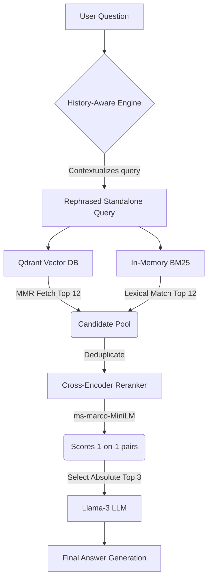

<div align="center">
  <h1>▶️ YouTube RAG AI Chatbot</h1>
  <p><i>An advanced, memory-aware Retrieval-Augmented Generation (RAG) agent that lets you "chat" with any YouTube video.</i></p>
  
  [](https://www.python.org/)
  [](https://langchain.com/)
  [](https://streamlit.io/)
  [](https://groq.com/)
  [](https://qdrant.tech/)
</div>

---

## 📖 Overview

**YT_Chat** is a production-grade, full-stack AI application designed to extract transcripts from YouTube URLs, index them semantically using vector embeddings, and allow granular conversational querying.

What makes this project special isn't just the fact that you can ask questions about a video—it's the **Hybrid Retrieval Pipeline** that sits under the hood. By intelligently blending lexical keyword tracking, dense vector similarity, and precision-based document re-ranking, the bot overcomes common AI hallucination problems and delivers pinpoint accurate answers.

---

## ✨ Core Features

- **📺 Instant Transcript Extraction**: Supply any YouTube URL, and the app instantly downloads and processes its closed captions.
- **🧠 Advanced Hybrid Search Engine**: Fuses **BM25** (keyword matching) with **MMR** (semantic diversity vector search) to guarantee context superiority.
- **🎯 Neural Re-ranking**: Uses HuggingFace Cross-Encoders (`ms-marco-MiniLM`) to mathematically re-evaluate and sort query chunks before sending them to the LLM.
- **💬 Conversational Memory Flow**: Implements a pure LangChain Expression Language (LCEL) History-Aware engine. You can ask contextual follow-up questions (e.g., *"Wait, what did he mean by that?"*) seamlessly.
- **⚡ Blazing Fast Generation**: Powered by the **Groq LPU** utilizing the massive `Llama-3.1-8b-instant` model.
- **🎨 Premium UI**: A highly responsive, glassmorphic Streamlit interface custom-built using responsive CSS injection.

---

## 🏗️ Architecture

How the AI retrieves and processes your questions behind the scenes:



---

## 🛠️ Technology Stack

| Component | Technology Used |
| :--- | :--- |
| **Framework** | Streamlit |
| **Orchestration** | LangChain (LCEL) |
| **Vector Database** | Qdrant (Local Native) |
| **LLM Inference** | Groq (`llama-3.1-8b-instant`) |
| **Lexical Search** | `rank_bm25` |
| **Embedder / Ranker** | `sentence-transformers` (`all-MiniLM-L6-v2` & `ms-marco`) |
| **Parsing** | `youtube-transcript-api` |

---

## 🚀 Local Installation

### 1. Clone the repository
```bash
git clone https://github.com/Samrat-Madake/yt_chat.git
cd yt_chat
```

### 2. Set up the Environment
It is recommended to use a virtual environment:
```bash
python -m venv yt_chat_venv
source yt_chat_venv/bin/activate  # On Windows: .\yt_chat_venv\Scripts\activate
```

### 3. Install Dependencies
```bash
pip install -r requirements.txt
```

### 4. Provide API Keys
Ensure you have API credentials from Groq & HuggingFace. Create a `.env` file in the root directory:
```env
GROQ_API_KEY="gsk_your_groq_api_key_here"
HUGGINGFACEHUB_API_TOKEN="hf_your_huggingface_token_here"
```

### 5. Run the Engine!
```bash
streamlit run app.py --server.fileWatcherType none
```
*(Open your browser to `http://localhost:8501`)*

---

## 📂 Project Structure

```bash
📦 yt_chat
 ┣ 📜 app.py               # Streamlit UI & Core loop
 ┣ 📜 loader.py            # Fetches URL transcripts via YouTube API
 ┣ 📜 chunker.py           # RecursiveCharacterTextSplitter logic
 ┣ 📜 vector_store.py      # Qdrant client connection & ingestion
 ┣ 📜 retriever.py         # Advanced Ensemble (BM25 + MMR + Reranker)
 ┣ 📜 rag_chain.py         # LCEL Conversational Memory Pipeline
 ┣ 📜 config.py            # Global variables (TOP_K, CHUNK_SIZE, etc.)
 ┣ 📜 requirements.txt     # Python dependencies
 ┣ 📜 .gitignore           # Git ignore settings
 ┗ 📜 .env                 # (Ignored) Secrets configuration
```

---

## ☁️ Deployment

This project is configured to run flawlessly on **Streamlit Community Cloud**. 

1. Link your GitHub repository in your Streamlit account.
2. Select `app.py` as the main entry point.
3. Add your `GROQ_API_KEY` and `HUGGINGFACEHUB_API_TOKEN` to the Streamlit **Secrets** configuration block. 
4. Deploy!

---

<div align="center">
  <i>Built with Python, Langchain, and a bit of magic.</i>
</div>
